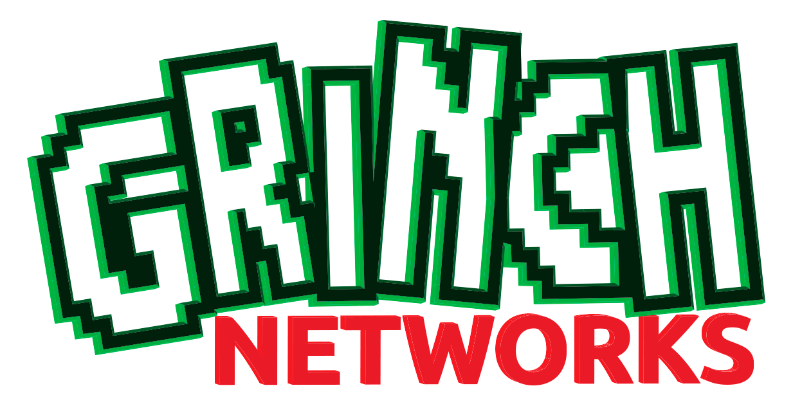

# Hacky Holidays 2021!

The Grinch has gone hi-tech this year with the intentions of ruining the holidays and we need you to infiltrate his network and take him down! 

For the next twelve days, starting at 12pm PT on Friday, December 10, 2021, the Grinch Networks will be releasing new functionality to their [website](https://hackyholidays.h1ctf.com/). Once you have found each flag, you will need to submit and validate it on Hacker101's [CTF platform](https://ctf.hacker101.com/ctf). At the end of the 12th challenge and once you have solved them all, you must submit a full writeup [here](hackerone.com/h1-ctf).

## Prizes and Awards

In the spirit of the holidays, all participants (anyone who submits at least a flag) will get added to HackerOne’s priority invitation queue to receive an invite to  private bug bounty program on HackerOne. In addition to every CTF flag you find, you’ll automatically receive points on Hacker101 so you could earn additional invites (one invite for every 26 points). Remember, some flags may weigh more than others! 

In addition to private program invitations, we have **$7,000**  in crash prizes up for grabs! So make sure to submit your write up by December 23, 2021 by 2:00 PM Pacific Time! 

- Our favorite report will also receive an invite to HackerOne's next live hacking event
- $2,000 for the first person to solve all challenges and submit a write up
- $1,000 for the most creative write up
- $1,000 for the first person to submit a 0 or no interaction (automated script) report
- Mistery bonuses (**$100-$500**)
- All winners will receive HackerOne swag
- Portswigger's Burp Suite Certified Practitioner Certificaion for up to 25 people

**In addition to the $2,000 awarded to the first person to solve this challenge, we'll be rewarding $250 to the first 10 hackers to solve the entire challenge as well.**

We welcome collaboration and teamwork, but we ask you to not share any hints, flags or write ups until the end of the competition.

Please take a moment to review [this page](https://hackerone.com/h1-ctf) for all additional announcements, rules and important information. 

Happy hacking and have a hacky holiday 

\- The community team at HackerOne

