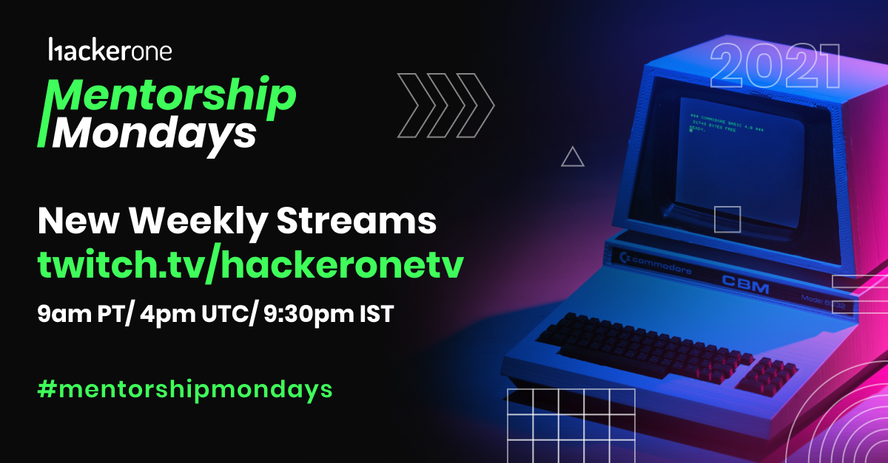

Mentorship Mondays is a series of live streams hosted by HackerOne's community team to help connect the hacker community to industry experts and help them develop skills to further their bug bounty and personal careers. We go live every Monday at 9:00 AM PT! 

<a class="btn btn-primary" href="https://twitch.tv/HackerOneTV">
  Watch us Live on Twitch!
</a>
