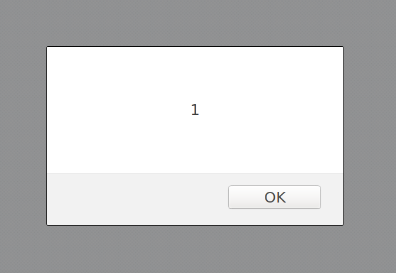

Related Session
---------------

<div class="container">
	<iframe id="ytplayer" type="text/html" width="640" height="360" src="https://www.youtube-nocookie.com/embed/HGaFCcWM57U?rel=0&autoplay=0&origin={{ site.url }}" frameborder="0"></iframe>
</div>

Description
-----------

Reflected XSS (Cross-Site Scripting) occurs when user input is inadequately validated or sanitized prior to being inserted into a page.

Security Impact
---------------

With reflected XSS, if an attacker can get a victim to go to a specific URL (e.g. `https://example.com/?param=<script>alert(1)</script>`), it is possible that the attacker may be able to execute arbitrary JavaScript in the page.  This allows the attacker to perform any action as the user, exfiltrate data, and more.

For example, you may see the following:

```
https://example.com/page?url=value
```

This vulnerable website does not escape nor validate the input and it is simply placed inside a link:

```
<a href={{ url_value_goes_here }}>Link</a>
```

Now if one submits the following we are prompted with an alert box display the value `1`:

```
" onload=alert(1)
```



A great way to determine in what context the XSS payload is executing is to use `alert(document.domain)`. The reason why one might want to do this, is to ensure that the injection endpoint is not located on a sandboxed domain.

Remediation
-----------

User input should always be encoded prior to output.  If the user input is being inserted into a script tag, it must be in string form and be string escaped, as well as ensuring that `<` and `>` are not included directly.  If the user input is going elsewhere on a page, it must be HTML entity encoded.

References
----------

- [https://www.owasp.org/index.php/Cross-site%5FScripting%5F(XSS)](https://www.owasp.org/index.php/Cross-site%5FScripting%5F%28XSS%29)

