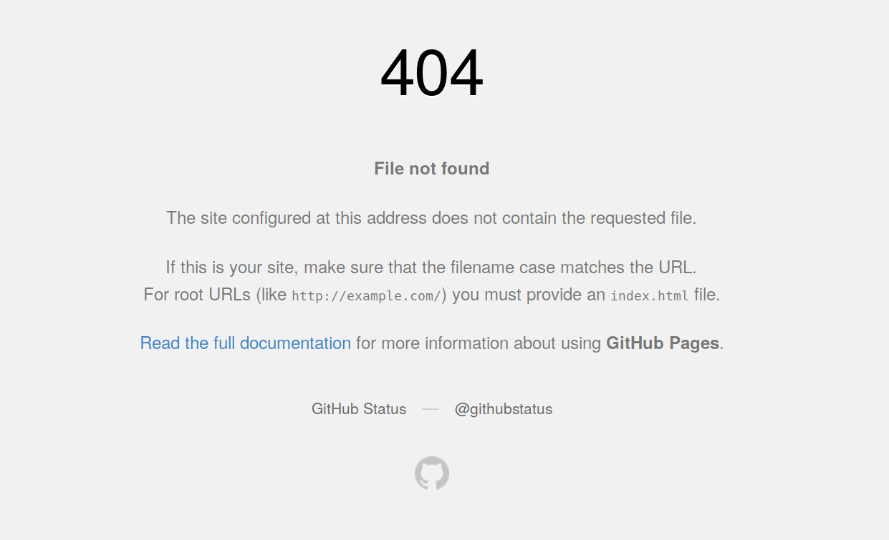
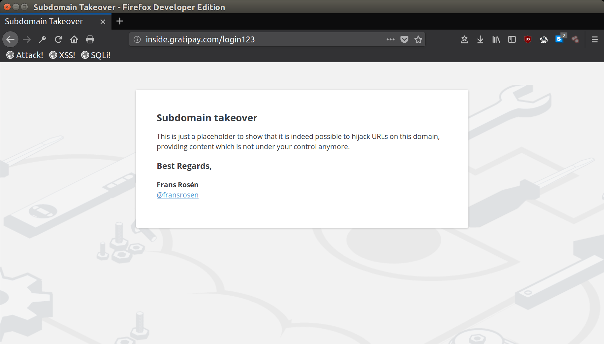

Description
-----------

Subdomain takeover vulnerabilities occur when a subdomain (subdomain.example.com) is pointing to a service (e.g. GitHub pages, Heroku, etc.) that has been removed or deleted. This allows an attacker to set up a page on the service that was being used and point their page to that subdomain. For example, if subdomain.example.com was pointing to a GitHub page and the user decided to delete their GitHub page, an attacker can now create a GitHub page, add a [CNAME file](https://github.com/Hacker0x01/hacker101/blob/master/CNAME) containing subdomain.example.com, and claim subdomain.example.com.

www.hacker101.com is a subdomain pointing to a GitHub page. If someone deletes https://github.com/Hacker0x01/hacker101 and forgets to remove the DNS entry pointing to this page, then you could serve content on www.hacker101.com.

Hackers commonly use subdomain scraping and brute-forcing tools such as [Sublist3r](https://github.com/aboul3la/Sublist3r) to find all the subdomains of a target. They will then check the DNS records and/or use a [screen-shot script](https://github.com/ChrisTruncer/EyeWitness) to detect vulnerable subdomains. A subdomain pointing to a GitHub page returning a 404, may be an indicator that it can be claimed on GitHub.

Security Impact
---------------

A successful subdomain takeover enables an attacker to serve content on the subdomain. If the subdomain is a child domain of the service's basename, then the attacker can read and set cookies on the basename too -- subdomain.example.com can set cookies for example.com.

Here is a real-world case of a subdomain takeover performed by [Frans Rosén](https://twitter.com/fransrosen) on inside.gratipay.com.

As you can see in the screenshot, Frans served a page on a hidden path (login123) instead of serving content on the landing page. It is best practice to do this so that you do not damage the company's image.

Remediation
-----------

Make sure to remove the DNS entry on the subdomain pointing to the deleted service to ensure that nobody can take it over.
